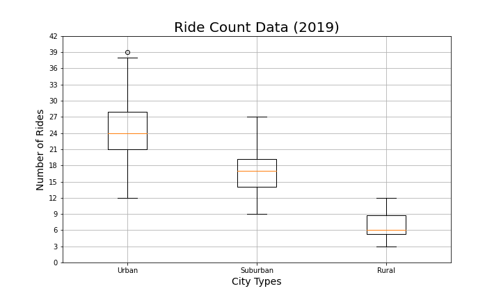

# PyBer_Analysis

Challenge 5 - Performing analysis on PyBer data with Jupyter Notebook under PythonData environment with Pandas, NymPy, SciPy statistics and Matplotlib using Python.

## Overview of the analysis

### Background

Amalyzing for PyBer is a overview of the ride-sharing data.  By converting the data to DataFrame, 

### Analysis Overview

In this project, following analyzations were provided: 
1. Converted the CSV files to Pandas DataFrames;
2. Defermined mean, median, and mode using NumPy, and SciPy statistics;
3. Using Matplotlip, created different kinds of charts for visualization the analyzing results for PyBer dara.

## Results

 - **PyBer Ride-Sharing Data(2019)**: In Urban area, the cost on average PyBer rids-shareing is the cheapest with the largest number of rides than other city types.  The larger of the population in a area will occure a chearper cost on ride-sharing.

- **Ride Count Data**: The largest number of ride in 2019 is 39 rides, which happened in urban city.  Averagely, residents in the urban cities are more willing to take sharing-rides (4 times more than the lowest rural cities ride count).  Rural cities are not good targets to promote on sharing-rides.

- **Ride Count Data(2019)**:  The average cost for the rural cities sharing-ride customers ($34.62)  are 41% more than the average cost in urban cities ($24.53).  With the city type being more rural, the cost on fare for rides gradually increased.

- **Driver Count Data(2019)**: There are more drivers in urban citires for the sharing-drive.  Only a few drivers would like to work with sharing drive in rural cities (averagely under 5 drivers for rural cities, and no more than 10 sharing-ride drivers in each rural cities).  

## Summary
1. For the urban cities, sharing-ride could be the main promoting product. For the rural cities, sharing-drive may not be profitable, furthure analysis on additional data should be provide for further analysis.
2. During the first quater of the year of 2019, March is the most popular month that people would like to choose sharing-rides for transporting.  For the years after, PyBer should prepare for this hot season to ensure the customer experience by controling the number of drivers that PyBer could provide.
3. In the urban cities, there are too many drivers.
